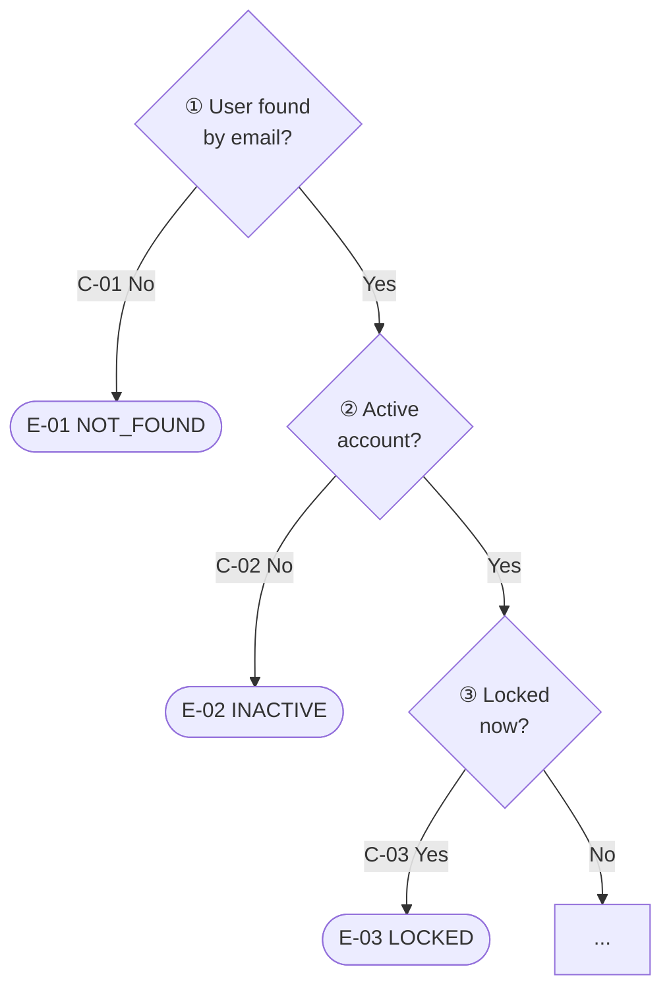

# File-Level Document Detailed Rules (Source Guide + Implementation Specification)

Read this file when authoring or modifying file-level documents in `docs/src-notes/`. The document structure, specification levels, and templates in `SKILL.md` §4.3 take precedence; below are the detailed authoring rules for the opening part, function sections, flow diagrams, algorithm sections, and implementation specification. For completed examples, see `src-note-example.md`.

## Common Authoring Rule: Role-First Description (what / how)

In file-level documents, descriptions of files, classes, functions, and public constants **lead with the role and leave both "what it does (project role / result)" and "how it does it (implementation method)" together.** Start with the feature behavior this code enables in the project, before internal implementation details.

A good description answers these questions in order.

1. Project role — What product/domain behavior does this code enable?
2. Actor/trigger — Who or what starts this behavior?
3. Result — What state change, user-visible behavior, or system progress occurs?
4. Implementation method — What technical method performs that role?

The following expressions are sufficient only when paired with the role and result.

- "passes to a handler"
- "puts into a queue"
- "parses the payload"
- "updates a value"
- "wraps an API"

Recommended sentence structure:

`When <actor/trigger> creates <domain event>, <this code> performs <system role> so that <result> occurs. <Core implementation method/supporting behavior>.`

Bad example:

```md
Receives run_events channel notifications through a queue, passes them to the handler, and passes fallback ticks when idle.
```

Good example:

```md
When the backend records evaluation run creation, cancellation, or resume events in `run_events`, PostgreSQL LISTEN/NOTIFY wakes the dispatcher so evaluation lifecycle processing starts. When there is no notification, fallback ticks prompt a DB recheck.
```

## Terminology Choice Detail

These are the remaining rules from `SKILL.md` §4 Terminology choice. The one-spelling-per-concept rule and the plain-wording rule are owned by §4.

- Use domain/project-specific terms (e.g., "order settlement," "session token," "feed ranking") verbatim so that meaning is not blurred
- Reuse expressions already established in the project; do not invent new terms for the same concept each time (check in order: `docs/spec-notes/`, existing `docs/src-notes/`, code identifiers)
- Do not use abbreviations, initialisms, or internal code names alone (parenthesize an expansion at first appearance)
- Do not translate code identifiers (function, constant, and field names); keep them verbatim

### Term Selection Criteria

When choosing section headings, item labels, edge labels, or result wording, check each candidate against the five criteria below. If any one fails, look for another term.

1. **Standard usage** — Is it a term actually used in design documents, specifications, and API docs? Do not use casual or colloquial wording in headings or labels
   - ✗ At a glance, What it does, When it runs, Does not do → ✓ Overview, Function, Invocation, Out of scope
   - ✗ Design background (awkward for a section that holds the file's reason for existing) → ✓ Purpose
2. **Conflicting meaning** — Does it already carry a different settled meaning in software development, or read as a term from another domain?
   - ✗ External input (reads as user input or request parameters) → ✓ Data sources (DB, configuration, environment variables read at runtime)
   - ✗ Scope (reads as variable scope or project scope) → ✓ Public interface
3. **Background-knowledge dependence** — Is it a term of art from a particular methodology or theory, so that a reader who does not know the concept cannot guess what the section holds?
   - ✗ Contract (a Design by Contract term) → ✓ Implementation specification
4. **Scope fit** — Is the range the name points to neither narrower nor wider than the actual content?
   - ✗ Key constants and variables (data fields such as `user.status` are mixed in) → ✓ Key constants and fields
   - ✗ Errors (also covers exceptions propagated as-is) → ✓ Errors and exceptions
5. **Meaning over mechanics** — Are results and states written as the behavior they mean rather than as implementation details?
   - ✗ exit 0 → ✓ pass (edit allowed)

Application rules:
- **Re-examine existing terms against the same criteria.** Do not keep a term merely because this skill's template or the project already uses it. If it fails a criterion, do not silently keep using it — report it to the user with an alternative. Until confirmed, keep the existing spelling so the one-spelling-per-concept rule still holds
- **When there are two or more candidates, or the call is unclear,** compare which criteria each candidate meets or fails and get the user's confirmation

## Opening Section Authoring Rules

### Table of contents
- Put `**Table of contents**` directly under the file title. Every file document has one
- Overview, Purpose, Usage example, and Implementation specification get the section name only; function and algorithm entries get ` — <one-line role>`. The Implementation specification entry lists the sub-items it contains
- Link anchors follow the GitHub heading anchor rules (lowercase, punctuation removed, spaces → `-`). E.g. `## [F-01] login` → `#f-01-login`, `## applyFailure [F-02] (internal function)` → `#applyfailure-f-02-internal-function`

### Overview
- The item names are fixed as **Function / Invocation / Result / Key rule / Specification level**
- **Function** — one sentence on the behavior this file enables in the product. Follows the role-first sentence structure
- **Invocation** — who or what calls it, and in which situation. If the caller cannot be confirmed from the code, do not guess; leave `To be confirmed` and fill it in during review
- **Result** — the result on success and on failure. Omit if there is neither a return value nor a side effect
- **Key rule** — if there is an algorithm, state its rule in one sentence with actual values and attach `[A-NN]`. Omit if there is none

### Purpose
- State why this file is needed and why this approach was chosen. What the code does belongs to the Overview, so do not repeat it
- One or two paragraphs of two or three sentences. One sentence per line

### Usage example
- Mandatory if there is a public function. One code block following the actual signature, with input and expected result together
- If the caller must tell failure results apart and handle them, show that handling too

## Function Section Authoring Rules

### Role description
- `## [F-NN] <function name>`. The ID goes first. Public functions first, internal functions after. Mark internal functions with `(internal function)`
- The first paragraph is one or two sentences on the role. If there is a flow diagram, summarize the whole flow in one sentence, such as "Proceeds in steps ① to ⑥ …"
- If an internal function refers to an algorithm, write **the outcome this function produces** before the reference. A section left as a bare reference is forbidden

### Case list (functions without a flow diagram)
- **Format** — `- [C-NN] <condition> → <result>`. The case ID goes first. If there is handling (a side effect), `[C-NN] <condition> → <handling> → <result>`. If one line defines two cases, write `[C-NN] [C-NN]`
- **Example** — on the indented next line, `e.g. <input> → <output>`. Synthetic data only. Real user or customer data is forbidden
- **Condition** — a sentence that is clearly true or false. Good: `Browser language is in the supported list`, `60 minutes or more have passed`. Bad: `if valid`, `where appropriate`
- **Order** — in the code's judgment order. The `otherwise` case comes last
- **If several external calls propagate an exception the same way**, they may be grouped into one **Common exceptions** line

```md
## [F-02] getDeviceLocale

Decides the language from the browser's language setting.
- [C-04] Browser language is in the supported list → that language
  e.g. `en-US` → `en`
- [C-05] Otherwise → the default language
  e.g. `ja-JP` → `ko`
```

### Supplementary items
After the diagram or case list in a function section, include only the items needed, in this order. If there is no such content, omit the item.
- **Step notes** — when there is a diagram. Start with the step number, as in `- ③ — <content>`. Write only what a judgment means (on what basis the diagram question is true), the reason for an order, boundary conditions, and side notes attached to a result. Do not restate the diagram's conditions or results
- **Boundary conditions** — when there is no diagram. Which result applies when a value equals the threshold, for null, 0, or empty values, or for identical timestamps. Not counted as cases
- **Common exceptions** — external-call exception propagation spanning several steps. `- [C-NN] Exception during ① lookup or ④ save → propagated as-is [E-NN]`
- **Out of scope** — standard and above. One line each for only what is intentionally not done, so that omissions (bugs) and decisions (non-targets) are distinguishable. If there is a responsible party, append it, as in `— caller's responsibility`

## Flow Diagram Rules (Mermaid)

### Presentation
- **Mandatory criteria** — `SKILL.md` §4.3.3. When not met, do not draw a diagram; write a case list
- **Notation** — `flowchart TD`. State machines use `stateDiagram-v2` in the algorithm section. Image files are forbidden (no diff, no reconciliation)
- **Decision nodes** — `{"③ Locked<br/>now?"}`. A step number ①②③… and a question answerable with yes or no. Step notes and the execution example table refer to the same numbers
- **Processing nodes** — `["⑤ Reset failures,<br/>then save"]`. Say in words what it does. When applying an algorithm, also write `apply A-NN`
- **Branch labels** — `Yes`/`No` or an actual value (`60 min or more`, `under 5`). A branch leading to a terminal node is prefixed with `C-NN` (`C-03 Yes`)
- **Terminal nodes** — an error ID and error code, as in `(["E-03 LOCKED"])`, or the returned result, as in `(["Return token<br/>token, userId"])`
- **Words and values** — code identifiers, function calls, and code expressions (`lockedUntil > now`, `findUserByEmail(email)`) are not written in the diagram. State what is judged in words and the criterion as an actual value. The mapping between identifiers and values belongs to the `Reference values:` line under the diagram and to Key constants and fields in the implementation specification
- **Reference-values line** — if constant values appear in the diagram, pair each value with its identifier on one line directly under the diagram. E.g. Reference values: 60 minutes `FAILURE_RESET_MINUTES`, 5 times `MAX_FAILURES`. When a constant value changes, update the diagram, reference values, key rule, and execution example together
- **Step nodes** — one node per judgment step, connected in judgment order. Do not gather several judgments into one node such as `{validate credentials}`
- **Subordination rule** — steps or branches not in the code are forbidden. **Branches leading into terminal nodes = case count**. Exception propagation spanning several steps is not drawn in the diagram; write it under **Common exceptions**

### Label syntax
- Wrap every node and branch label in double quotes (`{"..."}`, `["..."]`, `(["..."])`, `-->|"..."|`). Inside the quotes, parentheses, `≥ ≤ ≠ < >`, `·`, and circled numbers may be used as-is
- Do not put double quotes inside a label
- Insert line breaks directly with `<br/>`. Break lines at about 15 English characters. If a line is long, the renderer breaks it mid-word
- Do not put curly braces (`{ }`) inside a label. For a returned object, write only the field names, as in `token, userId`

### Size and exceptions
- **Size limit** — beyond 20 nodes, split per function
- **Where a diagram does not fit** — the following are excluded from the diagram mandate and expressed with the designated alternative
  - Result depends on a combination of several input conditions → list cases per combination
  - Parallel/async timing, retry intervals, race conditions → one paragraph under the role description
  - Formulas and data transformations → numbered procedure and formulas in the algorithm section
  - Recursion → state the termination condition and depth in the algorithm section
- **Render check** — check with `mmdc` (mermaid-cli). `npx -y @mermaid-js/mermaid-cli -i <file>.mmd -o <file>.png`. If it fails with a missing headless browser, create a config file `{"executablePath": "<Chrome path>"}` pointing to the installed Chrome and pass it with `-p <config file>`. If neither works, check with the GitHub or IDE preview and tell the user that the render could not be confirmed



## Algorithm Section Authoring Rules

- **Mandatory criteria** — `SKILL.md` §4.3.4. Simple fallback chains (stored value → device → default) and simple mappings (ko → ko-KR) end with cases
- Under `## [A-NN] <name>`, in order: **Rule** → **Rule rationale** → processing diagram → reference-values line → **Step notes** → **Execution example** → **Boundary conditions**
- **Rule** — state the **domain rule** this algorithm creates in plain prose with actual values. Reading only this item, without the procedure or tables, must tell you what happens to the user
  - ✗ `Tracks accumulated failures to prevent brute force` (that is intent, not the rule)
  - ✓ `If the password is wrong 5 times in a row, each within 60 minutes of the previous failure, login is blocked for 15 minutes from the last failure.`
- **Rule rationale** — list, item by item, why this rule, these values, and this approach were chosen
- **Processing diagram** — follows the flow diagram rules as-is. Calculation preparation steps (such as treating null as infinity) are not counted as separate nodes; fold them into the judgment question or the branch label (`Yes · incl. first failure`). If it only calculates in sequence without branches, write a numbered procedure instead of a diagram
- **Step notes** — where order changes the result (reset before increment, count reset after lockout, etc.), give the reason under that step number
- **Execution example** — table `Step | Before | Judgment | After`. Title the table with the situation (`A user with 4 failures gets it wrong again 30 minutes later`). The first row is `Start` with the initial state. After that, **one row per diagram step number**; never group them. A step that does not apply to this input still gets a row, with the reason in the judgment cell. Write values in words and actual values (`reached 5 → Yes`). Synthetic data only. One per algorithm, plus at most one for a boundary case
- **Boundary conditions** — which branch applies when a value exactly equals the threshold, or on the first run. Omit if already covered in the step notes
- **State machine** — `stateDiagram-v2`. Transition labels match the answers to the judgment questions
- If one algorithm spans several functions, write it here once and point to it from the function sections as `[A-NN]`

```md
| Step | Before | Judgment | After |
|---|---|---|---|
| Start | 4 failures, last failure 10:00, now 10:30 | - | - |
| ① | 30 minutes since last failure | under 60 min → No | still 4 failures |
| ② | 4 failures | - | 5 failures, last failure 10:30 |
| ③ | 5 failures | reached 5 → Yes | locked until 10:45, 0 failures |
```

## Implementation Specification Authoring Rules

The sub-items use bold subheadings (`**Data sources**`) with the names and in the order below, and are written as lists. Items not required at the file's specification level are omitted.

### Common items (all levels)
- **Data sources** — the runtime source. `Data sources: none`, or `<what> — <source and lookup path>. <fallback path, or none>`. If there are several sources, join them with `→` in the order they apply. Also state which judgment changes when the source value changes. Multiple sources and drift: `runtime-source-contract.md`
- **Public interface** — list externally exposed functions, types, and constants separately from internal-only ones, with `[F-NN]`. Internal constants are listed too. At `minimal`, append the role right here to any constant that governs a branch

### standard and above
- **Key constants and fields** — for each item, the first line is `NAME = <value>` for a constant or `field — <type / allowed values>` for a field (names in code formatting), and the indented next line gives one sentence on **which judgment this value governs and what happens when it is met**, plus the related ID
  - ✗ `MAX_FAILURES` = 5 / maximum allowed failure count — this only spells out the name; it says nothing about behavior
  - ✓ `MAX_FAILURES` = 5 / when consecutive failures reach this count, the account is locked. [A-01]
  - For enum and state values, state which result each value leads to (`only ACTIVE can log in; the rest are rejected at ②`)
- **Errors and exceptions** — one line each in the form `E-NN <error kind / code> — <trigger condition>` (ID and code in code formatting). External exceptions that are not caught and propagated as-is also get one line (`original exception propagated as-is`). If the code throws an error not listed here, it is a §1.2 scope deviation
- **External integrations** — one line each for DB reads/writes, network calls, file I/O, global/cache mutations, event emissions, and external functions called. The form is `<name> (<kind>) — <at which step, how many times>. <handling on failure> [E-NN]`, with the name in code formatting. If none, write `none`. Link external APIs to `docs/spec-notes/`

### full
- **Output schema** — a table of `name | type | nullable | value range / constraint` per field of the returned object. List every candidate for enum fields. JSON Schema format is recommended for deep nesting
- **Pre/postconditions and invariants** — preconditions (guaranteed by the caller before the call), postconditions (guaranteed by this function after the call), invariants (maintained before and after the call). Write each condition so it can be turned into an assertion
- **Test traceability** — every function, case, and error ID must be back-referenced by test cases in `docs/test-notes/`. Uncited ID = missing test; cited but nonexistent ID = stale test

## Document-Wide Common Rules

- **ID scheme** — functions `[F-NN]`, cases `[C-NN]`, errors `[E-NN]`, algorithms `[A-NN]`. These four are the only prefixes, and `NN` is a two-digit sequence number. If a prefix exceeds 99 in one document, write that prefix with three digits (`C-001`) throughout the document so the leading IDs always have the same width. Variants and suffixes such as `E-EDGE-01` and `C-EXC-01` are forbidden. `[F-NN]` is assigned only to functions this file defines
- **ID numbering** — unique within the file and numbered sequentially across the whole file. Never reassign. When retired, mark `(deprecated)` and issue a new number
- **ID references** — do not leave an ID standing alone in the text. Make clear in the sentence or label what the ID is (`see [A-01] for how it is judged`, `exception propagated as-is [E-06]`)
- **Enumeration** — cases, exceptions, and side effects are enumerated as a list, one per line. "Various handling," "etc.," and "and so on" are forbidden
- **Verifiable expression** — "appropriately," "correctly," "if necessary," "when possible," and "handles" are forbidden. Instead of quantity-dodging wording such as "for a while" or "several times," write the actual value. Describe only observable behavior
  - ✗ "handles the error appropriately" → ✓ "throws `AUTH_FAIL` and saves the failure count"
- **Input outside the cases** — if an input combination not covered by a case occurs during implementation, treat it as a §1.2 scope deviation

## Change-Review Markup Rules

These are the detailed rules for `SKILL.md` §4.3.8. The cleanup script `review-clean.sh` removes this format mechanically, so use only the shapes defined below. For the completed form, see `src-note-review-example.md`.

### Review block
- The content between the `🔍 **Review block start**` line and the `🔍 **Review block end**` line is deleted entirely at cleanup, together with those two lines. Each marker occupies a line on its own, with one blank line before and after it. Do not nest a block inside a block
  - Do not use HTML comments (`<!-- … -->`) as markers. With several comments in a document, some rich editors show the whole document as raw source. A text-line marker shows up as-is in any editor
  - Korean documents use `🔍 **리뷰 블록 시작**` and `🔍 **리뷰 블록 끝**`
- What goes in a review block:
  - **Review notice** — directly under the title. A notice that the document is under review with a link to the Change review section, the marker legend (`🟢 added　🟠 changed　🔴 removed　⬜ unchanged (diagram)`), and a notice that it will be cleaned up after implementation
  - **Change review section** — directly under the table of contents
  - **Section change summary** — a one-line quote directly under the heading of an affected section. `> 🟢 **Change 1** <summary> · 🟠 **Change 2** <summary>`
  - **Change comparison diagram** — its heading line and the whole diagram

### Change review section
Order: **Changes** → **Removed** → **Impact outside this file** → **Review questions**.
- **Changes** — list only behaviors that actually change. Use the format below for each change. A reader who does not know the current code must still see what changes and how
  ```
  **Change N** <marker> <what the change is about>
  - **Current**: <how it behaves now>
  - **After**: <how it behaves after the change, with actual values and related IDs>
  - **Reason**: <why it changes>
  - **Affected sections**:
    - [section](#anchor) — <what is revised in that section>
  ```
  - The title states **what the change is about**, not a feature or option name (✗ `--git-hooks=<folder>` → ✓ How to enable the commit check in existing repositories)
  - Even when adding a new feature, do not leave **Current** empty. State what one has to do now without the feature, so it is clear what the addition solves
  - If only the requester knows the **Reason**, do not guess; write `To be confirmed` and ask in the review questions
  - Number changes from 1 in each document
- Changes to constants, fields, errors, or external integrations in the implementation specification are consequences of a change, so they are not counted as separate changes; list them in that change's affected sections
- **Removed** — behaviors that go away. If none, `None`
- **Impact outside this file** — other files, DB/schema, test IDs
- **Review questions** — what the reviewer must decide. Prefix each with the related change number. Do not guess at content only the requester knows, such as rationale or policy; ask here instead

### Line marker
- There are three markers, 🟢 (added), 🟠 (changed), 🔴 (removed), placed **only at the very start of a line**: the first character position after indentation, the list marker `- `, or the quote marker `> `. Several may be chained (`🟢🟠`), followed by one space. Never place them in the middle or at the end of a line
- At cleanup, 🟢 and 🟠 markers are removed and the line stays. A line with a 🔴 marker is deleted together with the following lines indented deeper than it
- A removed item stays in place in the body during review as `- 🔴 ~~<original content>~~`, so it is visible what goes away
- In the table of contents, mark an affected section's line like `- 🟢🟠 [Section](#anchor) — <role> — change 1·2`. The trailing ` — change N·N` is removed at cleanup. Use this trailing form only in the table of contents

### Value markup
- **Changed value** — `~~old~~ **new**`. Only `new` remains after cleanup. Put exactly one space between the two parts (with no space or two spaces they are not recognized as a pair, and `**new**` stays bold)
- **Inserted words** — words newly added to an existing sentence are `<ins>new words</ins>`. Only the tags are removed at cleanup
- **Deleted words** — words dropped from a sentence are written only as `~~deleted words~~` (no `**…**` after). They are removed at cleanup together with one preceding space
- Use the same markup inside table cells. Do not mark a new value with `**…**` alone just because it needs emphasis (it would stay bold after cleanup)

### Diagram
- **Structural change** (adding, removing, or reordering decision/processing steps) — put a comparison diagram in the review block. Inside `flowchart LR`, place `subgraph BEFORE["Current"]` and `subgraph AFTER["After"]`, each with `direction TB`, and end with `BEFORE ~~~ AFTER`. Draw only the changed segment; fold the unchanged parts before and after into a single node such as `["①–④ unchanged"]` and color it `same`. Prefix node IDs with `a` and `b` so the two sides do not collide
- **Main diagram** — always draws the whole post-change flow. Color added and changed nodes. Removed nodes are not drawn in the main diagram; they appear only on the `Current` side of the comparison diagram
- **Value-only change** — no comparison diagram. Color the node in the main diagram `changed` and append `<br/>current <old value>` to the end of its label
- **Color definitions** — write only the needed lines of the four below at the end of the diagram, exactly as given. Do not change the names or styles. Apply them with a single `class <nodeID,…> <name>` line
  ```
  classDef added fill:#e3f5e1,stroke:#2e7d32,stroke-width:2px,color:#1b1b1b
  classDef changed fill:#fff1dc,stroke:#ef6c00,stroke-width:2px,color:#1b1b1b
  classDef removed fill:#fde7e7,stroke:#c62828,stroke-width:2px,stroke-dasharray:5 5,color:#1b1b1b
  classDef same fill:#eeeeee,stroke:#bdbdbd,color:#757575
  ```
- Give the two areas of the comparison diagram `style BEFORE fill:#f5f5f5,stroke:#9e9e9e` and `style AFTER fill:#ffffff,stroke:#9e9e9e` so the default background colors are not confused with the change-marker colors

### Cleanup result
`review-clean.sh` does the following in order. After it runs, the document must match the ordinary file-document format (§4.3.1–§4.3.7).
1. Delete review blocks
2. Delete 🔴 lines and their following lines
3. Delete 🟢 and 🟠 markers at the start of lines
4. Delete the trailing ` — change N·N` on table of contents lines
5. `~~old~~ **new**` → `new`, `<ins>…</ins>` → tags removed, standalone `~~…~~` deleted
6. Delete the diagrams' `classDef added|changed|removed|same` lines, the `class` lines applying those names, and `<br/>current …` in labels
7. Collapse consecutive blank lines into one
- If markers remain after cleanup (markers written in a form that does not fit the rules), the script reports their line numbers. Fix those spots to follow the rules and run it again
