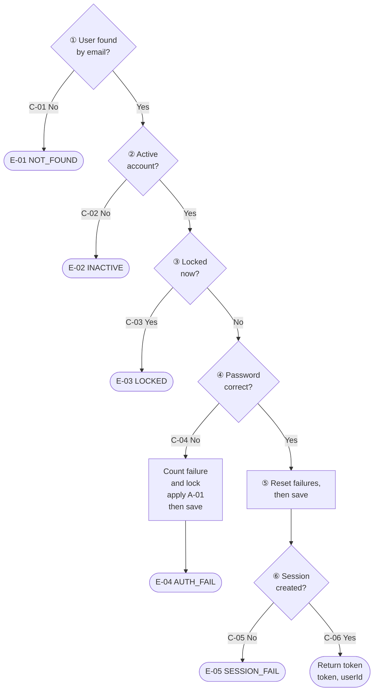
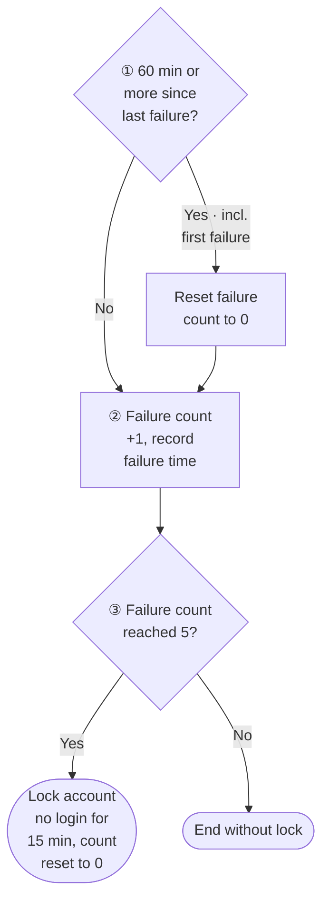

# Completed File-Level Document Examples

Use these examples to see what the document structure in `SKILL.md` §4.3 looks like in practice. The rules in `SKILL.md` §4.3 and `src-note-contract.md` take precedence. There are two: a large file (`standard`, with a flow diagram and an algorithm section) and a small file (`minimal`, with no conditional sections).

In both examples only the target source file is given, so the callers cannot be confirmed. That is why the Invocation item in the Overview is left as `To be confirmed`. In a real project, find the callers and fill it in.

## Example 1 — `standard`, a file with a flow diagram and an algorithm section

Target source:

```ts
// src/services/auth/login.ts
import { findUserByEmail, saveUser, createSession } from "../../repo";
import { verifyHash } from "../../crypto";

const MAX_FAILURES = 5;
const LOCK_MINUTES = 15;
const FAILURE_RESET_MINUTES = 60;

export class AuthError extends Error {
  constructor(public code: string) { super(code); }
}

export async function login(email: string, password: string, now: Date = new Date()) {
  const user = await findUserByEmail(email);
  if (!user) throw new AuthError("NOT_FOUND");
  if (user.status !== "ACTIVE") throw new AuthError("INACTIVE");
  if (user.lockedUntil && user.lockedUntil > now) throw new AuthError("LOCKED");

  const ok = await verifyHash(password, user.passwordHash);
  if (!ok) {
    applyFailure(user, now);
    await saveUser(user);
    throw new AuthError("AUTH_FAIL");
  }

  user.failureCount = 0;
  user.lockedUntil = null;
  await saveUser(user);

  try {
    const session = await createSession(user.id, now);
    return { token: session.token, userId: user.id };
  } catch (e) {
    throw new AuthError("SESSION_FAIL");
  }
}

function applyFailure(user, now: Date) {
  const minutesSinceLast = user.lastFailureAt
    ? (now.getTime() - user.lastFailureAt.getTime()) / 60000
    : Infinity;
  if (minutesSinceLast >= FAILURE_RESET_MINUTES) user.failureCount = 0;
  user.failureCount += 1;
  user.lastFailureAt = now;
  if (user.failureCount >= MAX_FAILURES) {
    user.lockedUntil = new Date(now.getTime() + LOCK_MINUTES * 60000);
    user.failureCount = 0;
  }
}
```

The document path, per the §4.1 rule, is `docs/src-notes/src/services/auth/login.ts.md`.

````markdown
# src/services/auth/login.ts

**Table of contents**
- [Overview](#overview)
- [Purpose](#purpose)
- [Usage example](#usage-example)
- [F-01] [login](#f-01-login) — Verifies credentials, then creates a session. Six-step flow
- [F-02] [applyFailure](#f-02-applyfailure-internal-function) — Records one password failure (internal function)
- [A-01] [Login failure lockout](#a-01-login-failure-lockout) — 5 failures within 60 minutes lock the account for 15 minutes
- [Implementation specification](#implementation-specification) — Data sources, public interface, constants and fields, errors and exceptions, external integrations

## Overview

- **Function** — Authenticates a user by email and password and, on success, creates a login session and issues a token.
- **Invocation** — To be confirmed. This file has no callers. Fill in the API route that handles login requests during review.
- **Result** — On success, returns `{ token, userId }`. On failure, throws an `AuthError` carrying the failure reason code.
- **Key rule** — If the password is wrong 5 times in a row within 60 minutes, the account cannot log in for 15 minutes. [A-01]
- **Specification level** — standard

## Purpose

Password comparison alone cannot stop an attack that guesses the password by entering it repeatedly (brute force).
So consecutive failures are accumulated, and when they reach the threshold the account is locked for a fixed time.

All failure reasons are unified into a single `AuthError`, distinguished only by code (`NOT_FOUND`, `LOCKED`, etc.).
The caller can choose a message such as "No such account" or "Try again later" from the code alone.

## Usage example

```ts
const { token, userId } = await login("a@example.com", "pw")

try {
  await login("a@example.com", "wrong")
} catch (e) {
  if (e instanceof AuthError && e.code === "LOCKED") {
    // show the lockout notice
  }
}
```

## [F-01] login

Verifies credentials and, on success, creates a session.
Proceeds in steps ① to ⑥; if any step fails, it ends with an error at that step.



**Step notes**
- ② — An account is active only when its status is `ACTIVE`.
  Because it is rejected before password comparison, an inactive account's failure count does not increase.
- ③ — The account is locked if the unlock time has not yet arrived.
  This is checked before password comparison. If a locked account's password were compared, a wrong password would raise the failure count again and the lock could keep being extended.
  Boundary: if the unlock time equals now, the lock is treated as released and it proceeds to ④.
- ⑤ — Done before session creation. A password match is a settled fact regardless of the session creation result, so even if ⑥ fails, the failure record has already been reset.
- ⑥ — A session creation exception discards the original exception and passes on only the code. The cause of the failure is not kept.

**Common exceptions**
- [C-07] Exception during ① lookup, ④ comparison, or ④/⑤ save → propagated as-is without conversion [E-06]

**Out of scope**
- Email format validation — caller's responsibility
- Token refresh — responsibility of the refresh feature
- Recording login attempts in an audit log

## [F-02] applyFailure (internal function)

Records one password failure in the user information.
If this failure reaches the threshold, it locks the account; otherwise it only raises the failure count. See [A-01] for how it is judged.

It changes only the user information object and does not save to the DB. Saving happens at step ④ of the calling `login`.

## [A-01] Login failure lockout

**Rule**
If the password is wrong 5 times in a row, each within 60 minutes of the previous failure, login is blocked for 15 minutes from the last failure.
After the lock period, the failure count starts again from 0.

**Rule rationale**
- After 60 minutes the failure count is reset. This keeps a user who occasionally mistypes from being locked out by adding up old mistakes.
- The lock time is stored in the DB, not in server memory. Even with several servers, every server makes the same judgment.



Reference values: 60 minutes `FAILURE_RESET_MINUTES`, 5 times `MAX_FAILURES`, 15 minutes `LOCK_MINUTES`

**Step notes**
- ① — For the first failure there is no previous failure time, so it is treated as a failure long ago and goes to "Yes".
  Exactly 60 minutes elapsed is also "Yes" (60 minutes "or more").
  This must be checked before ② so that old failures are not added to the new one.
- ③ — When locking, the failure count is set back to 0. This makes counting start over after the lock is released.

**Execution example** — A user with 4 failures gets it wrong again 30 minutes later

| Step | Before | Judgment | After |
|---|---|---|---|
| Start | 4 failures, last failure 10:00, now 10:30 | - | - |
| ① | 30 minutes since last failure | under 60 min → No | still 4 failures |
| ② | 4 failures | - | 5 failures, last failure 10:30 |
| ③ | 5 failures | reached 5 → Yes | locked until 10:45, 0 failures |

## Implementation specification

**Data sources**
- User information (status, failure count, lock time, password hash)
  Looked up from the `users` table via `findUserByEmail`. No fallback path.
- If a new status value is added to `users.status`, the judgment at ② may change. Currently everything other than `ACTIVE` is rejected.

**Public interface**
- Exposed: `login` [F-01], `AuthError`
- Internal only: `applyFailure` [F-02], constants `MAX_FAILURES`, `LOCK_MINUTES`, `FAILURE_RESET_MINUTES`

**Key constants and fields**
- `MAX_FAILURES` = 5
  When consecutive failures reach this count, the account is locked. [A-01]
- `LOCK_MINUTES` = 15
  Lock duration (minutes). Added to the last failure time to set the unlock time. [C-03]
- `FAILURE_RESET_MINUTES` = 60
  Once this many minutes have passed since the previous failure, the failure count is reset. [A-01]
- `user.status` — `ACTIVE` | `INACTIVE` | `SUSPENDED`
  Only `ACTIVE` can log in. The rest are rejected at ②. [C-02]
- `user.lockedUntil` — timestamp, nullable
  Locked if later than now. [C-03]
- `user.lastFailureAt` — timestamp, nullable
  The reference time for deciding whether to reset the failure count. [A-01]

**Errors and exceptions**
- `E-01` `AuthError("NOT_FOUND")` — no such user
- `E-02` `AuthError("INACTIVE")` — the account is not active
- `E-03` `AuthError("LOCKED")` — the account is locked
- `E-04` `AuthError("AUTH_FAIL")` — password mismatch
- `E-05` `AuthError("SESSION_FAIL")` — session creation failed. The original exception is discarded
- `E-06` original exception propagated as-is — exception during user lookup, password comparison, or save

**External integrations**
- `findUserByEmail` (DB read) — always once at ①. On exception, propagated as-is [E-06]
- `verifyHash` — once at ④. On exception, propagated as-is [E-06]
- `saveUser` (DB write) — once at ④ or ⑤. On exception, propagated as-is [E-06]
- `createSession` (DB write) — once at ⑥. On exception, converted to `SESSION_FAIL` [E-05]
````

## Example 2 — `minimal`, a file with no conditional sections

Target source:

```ts
// src/i18n/locale.ts
export const SUPPORTED_LOCALES = ["ko", "en"] as const
export type Locale = (typeof SUPPORTED_LOCALES)[number]
export const DEFAULT_LOCALE: Locale = "ko"
const STORAGE_KEY = "app.locale"
const INTL_TAG: Record<Locale, string> = { ko: "ko-KR", en: "en-US" }

export function isSupportedLocale(value: unknown): value is Locale {
  return typeof value === "string" && (SUPPORTED_LOCALES as readonly string[]).includes(value)
}

export function getDeviceLocale(): Locale {
  const lang = typeof navigator !== "undefined" ? navigator.language : ""
  const primary = lang.split("-")[0]
  return isSupportedLocale(primary) ? primary : DEFAULT_LOCALE
}

export function getCurrentLocale(): Locale {
  const stored = localStorage.getItem(STORAGE_KEY)
  return isSupportedLocale(stored) ? stored : getDeviceLocale()
}

export function setCurrentLocale(locale: Locale): void {
  localStorage.setItem(STORAGE_KEY, locale)
}

export function intlLocaleTag(locale: Locale = getCurrentLocale()): string {
  return INTL_TAG[locale]
}
```

The document path is `docs/src-notes/src/i18n/locale.ts.md`.

````markdown
# src/i18n/locale.ts

**Table of contents**
- [Overview](#overview)
- [Purpose](#purpose)
- [Usage example](#usage-example)
- [F-01] [isSupportedLocale](#f-01-issupportedlocale) — Checks whether a value is a supported language code
- [F-02] [getDeviceLocale](#f-02-getdevicelocale) — Decides the language from the browser language
- [F-03] [getCurrentLocale](#f-03-getcurrentlocale) — Decides the language to use now
- [F-04] [setCurrentLocale](#f-04-setcurrentlocale) — Saves the chosen language
- [F-05] [intlLocaleTag](#f-05-intllocaletag) — Converts to a tag for the Intl API
- [Implementation specification](#implementation-specification) — Data sources, public interface

## Overview

- **Function** — Decides the language to display in the app and converts it to the language tag needed for date and number display.
- **Invocation** — To be confirmed. This file has no callers. Fill in the call paths from screen rendering and the language settings screen during review.
- **Key rule** — The language is decided in the order user-chosen language → device language → default language (Korean). Two languages are supported: Korean and English.
- **Specification level** — minimal (single-responsibility utility)

## Purpose

The user-chosen language is checked before the device language.
This keeps a user on an English device who chose Korean from being switched back to English by the device setting on the next visit.

## Usage example

```ts
setCurrentLocale("ko")
getCurrentLocale()  // "ko"
intlLocaleTag()     // "ko-KR" — pass to Intl.DateTimeFormat, etc.
```

## [F-01] isSupportedLocale

Checks whether the given value is a supported language code.
- [C-01] It is a string and is in the supported language list → `true`
  e.g. `"en"` → `true`
- [C-02] Otherwise → `false`
  e.g. `"ja"`, `null` → `false`

## [F-02] getDeviceLocale

Decides the language from the browser's language setting.
If a region code is attached, as in `en-US`, only the leading language code (`en`) is considered.
- [C-03] Browser information is unavailable (e.g. running on the server) → the default language
- [C-04] Browser language is in the supported list → that language
  e.g. `en-US` → `en`
- [C-05] Otherwise → the default language
  e.g. `ja-JP` → `ko`

## [F-03] getCurrentLocale

Decides the language the app uses now.
- [C-06] A saved user-chosen language exists and is supported → the saved language
  e.g. saved `ko`, device `en-US` → `ko`
- [C-07] Otherwise (no saved value, or an unsupported value) → decided by the device language [F-02]

## [F-04] setCurrentLocale

Saves the language the user chose in the browser so it persists on the next visit.
- [C-08] Always saves, no return value

## [F-05] intlLocaleTag

Converts a language code to the tag format the Intl API requires.
- [C-09] Language given → that language's tag
  e.g. `ko` → `ko-KR`
- [C-10] Language not given → the tag of the current language [F-03]

## Implementation specification

**Data sources**
Saved chosen language (localStorage `app.locale`) → browser language (`navigator.language`) → default language

**Public interface**
- Exposed functions: `isSupportedLocale` [F-01], `getDeviceLocale` [F-02], `getCurrentLocale` [F-03], `setCurrentLocale` [F-04], `intlLocaleTag` [F-05]
- `SUPPORTED_LOCALES` (exposed) = `ko`, `en`
  Any language not in this list is handled as the default language. [C-02]
- `DEFAULT_LOCALE` (exposed) = `ko`
  Used when neither the saved language nor the device language is supported.
- `STORAGE_KEY` (internal) = `app.locale`
  The key used to save the user-chosen language in the browser.
- `INTL_TAG` (internal) = `ko` → `ko-KR`, `en` → `en-US`
  The mapping from language codes to Intl tags.
````
