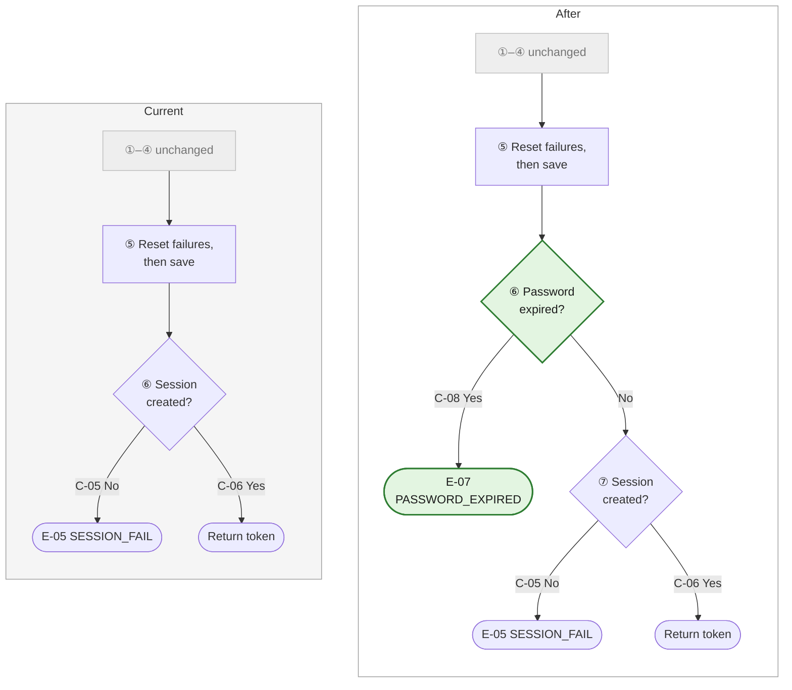
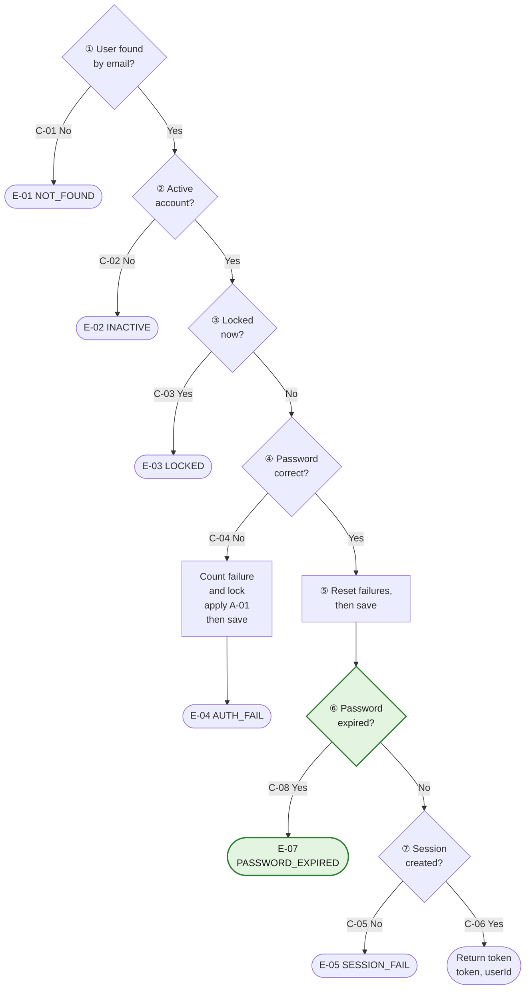
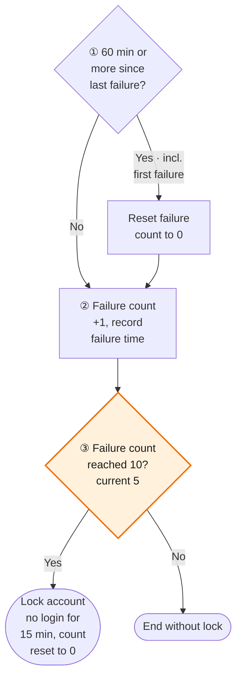

# Completed Change-Review Document Example

Use this example to see what the change-review markup in `SKILL.md` §4.3.8 looks like in practice. The rules in `SKILL.md` §4.3.8 and the **Change-Review Markup Rules** in `src-note-contract.md` take precedence.

The situation: two changes have been requested to Example 1 (`login.ts`) in `src-note-example.md`.
- **Change 1** — Block login for accounts whose password was changed more than 90 days ago. This adds one decision step, a **structural change**, so a comparison diagram is included
- **Change 2** — Change the lockout threshold from 5 to 10 failures. The flow stays the same and **only a value changes**, so only the node in the main diagram is colored

The body is already rewritten to its post-change form. After implementation and comparison are done, running `review-clean.sh` removes all review blocks and markers, leaving a current document in the Example 1 format.

````markdown
# src/services/auth/login.ts

🔍 **Review block start**

> **🔍 Document under review** — The body is rewritten to its post-change form. See [Change review](#change-review) for a summary of the changes.
>
> 🟢 added　🟠 changed　🔴 removed　⬜ unchanged (diagram)
>
> Once implementation and comparison are done, `review-clean.sh` removes this notice, the Change review section, the comparison diagram, and all markers.

🔍 **Review block end**

**Table of contents**
- 🟢🟠 [Overview](#overview) — change 1·2
- [Purpose](#purpose)
- [Usage example](#usage-example)
- 🟢 [F-01] [login](#f-01-login) — Verifies credentials, then creates a session. Seven-step flow — change 1
- [F-02] [applyFailure](#f-02-applyfailure-internal-function) — Records one password failure (internal function)
- 🟠 [A-01] [Login failure lockout](#a-01-login-failure-lockout) — 10 failures within 60 minutes lock the account for 15 minutes — change 2
- 🟢🟠 [Implementation specification](#implementation-specification) — Data sources, public interface, constants and fields, errors and exceptions, external integrations — change 1·2

🔍 **Review block start**

## Change review

**Changes**

**Change 1** 🟢 Logging in with an old password
- **Current**: If the password is correct, login succeeds no matter when the password was last changed.
- **After**: An account whose password was changed 90 or more days ago is blocked from login even with the correct password, and a `PASSWORD_EXPIRED` error is returned. [C-08] [E-07]
- **Reason**: Require a password change at a fixed interval so that old passwords are not used indefinitely.
- **Affected sections**:
  - [Overview](#overview) — key rule added
  - [login](#f-01-login) — step ⑥ expiry check added, former step ⑥ session creation renumbered to ⑦, step notes and out-of-scope entries added
  - [Implementation specification](#implementation-specification) — data sources (password change time), public interface and key constants (`PASSWORD_MAX_AGE_DAYS`), field (`user.passwordChangedAt`), error (E-07), external integrations (step numbers)

**Change 2** 🟠 Number of consecutive failures that locks an account
- **Current**: Five consecutive wrong passwords within 60 minutes lock the account for 15 minutes.
- **After**: The account is locked only after 10 consecutive failures. The 60 and 15 minutes are unchanged. [A-01]
- **Reason**: To be confirmed — see the review questions
- **Affected sections**:
  - [Overview](#overview) — the count in the key rule
  - [Login failure lockout](#a-01-login-failure-lockout) — rule, rule rationale, diagram step ③, reference values, execution example
  - [Implementation specification](#implementation-specification) — key constant (`MAX_FAILURES`)

**Removed** — None

**Impact outside this file**
- Other files: when the login screen receives `PASSWORD_EXPIRED`, it must send the user to the password change screen (to be confirmed — screen code path)
- DB: confirm whether the `users.passwordChangedAt` column already exists. If not, a schema change must come first
- Tests: expected values in the [A-01] execution example, [C-06] success path (add the not-expired account condition)

**Review questions**
- Change 1 — An expired account still entered the correct password, so the failure record is reset at ⑤ before login is blocked. Should it not be reset?
- Change 1 — Should existing accounts with an empty `passwordChangedAt` be treated as expired?
- Change 1 — Does the 90-day expiry period match the policy?
- Change 2 — Confirm the rationale for raising it to 10 (content for the rule rationale)

🔍 **Review block end**

## Overview

🔍 **Review block start**

> 🟢 **Change 1** key rule added · 🟠 **Change 2** lockout count

🔍 **Review block end**

- **Function** — Authenticates a user by email and password and, on success, creates a login session and issues a token.
- **Invocation** — To be confirmed. This file has no callers. Fill in the API route that handles login requests during review.
- **Result** — On success, returns `{ token, userId }`. On failure, throws an `AuthError` carrying the failure reason code.
- 🟠 **Key rule** — If the password is wrong ~~5 times~~ **10 times** in a row within 60 minutes, the account cannot log in for 15 minutes. [A-01]
- 🟢 **Key rule** — If 90 days have passed since the password was changed, the account cannot log in. [C-08]
- **Specification level** — standard

## Purpose

Password comparison alone cannot stop an attack that guesses the password by entering it repeatedly (brute force).
So consecutive failures are accumulated, and when they reach the threshold the account is locked for a fixed time.

All failure reasons are unified into a single `AuthError`, distinguished only by code (`NOT_FOUND`, `LOCKED`, etc.).
The caller can choose a message such as "No such account" or "Try again later" from the code alone.

## Usage example

```ts
const { token, userId } = await login("a@example.com", "pw")

try {
  await login("a@example.com", "wrong")
} catch (e) {
  if (e instanceof AuthError && e.code === "LOCKED") {
    // show the lockout notice
  }
}
```

## [F-01] login

🔍 **Review block start**

> 🟢 **Change 1** step ⑥ password expiry check added. Former step ⑥ session creation moves to ⑦

🔍 **Review block end**

Verifies credentials and, on success, creates a session.
Proceeds in steps ① to ⑦; if any step fails, it ends with an error at that step.

🔍 **Review block start**

**Change comparison** — changed segment only (①–④ unchanged)



🔍 **Review block end**



**Step notes**
- ② — An account is active only when its status is `ACTIVE`.
  Because it is rejected before password comparison, an inactive account's failure count does not increase.
- ③ — The account is locked if the unlock time has not yet arrived.
  This is checked before password comparison. If a locked account's password were compared, a wrong password would raise the failure count again and the lock could keep being extended.
  Boundary: if the unlock time equals now, the lock is treated as released and it proceeds to ④.
- 🟠 ⑤ — Done before session creation. A password match is a settled fact regardless of the session creation result, so even if ~~⑥~~ **⑦** fails, the failure record has already been reset.
- 🟢 ⑥ — The password is expired if 90 days or more have passed since the last password change.
  This is checked after the password matches. Reporting expiry for a wrong password would expose the account's state.
  Boundary: exactly 90 days is expired (90 days "or more").
- 🟠 ~~⑥~~ **⑦** — A session creation exception discards the original exception and passes on only the code. The cause of the failure is not kept.

**Common exceptions**
- [C-07] Exception during ① lookup, ④ comparison, or ④/⑤ save → propagated as-is without conversion [E-06]

**Out of scope**
- Email format validation — caller's responsibility
- Token refresh — responsibility of the refresh feature
- Recording login attempts in an audit log
- 🟢 Password change handling — responsibility of the password change feature. This file only reports the expiry error

## [F-02] applyFailure (internal function)

Records one password failure in the user information.
If this failure reaches the threshold, it locks the account; otherwise it only raises the failure count. See [A-01] for how it is judged.

It changes only the user information object and does not save to the DB. Saving happens at step ④ of the calling `login`.

## [A-01] Login failure lockout

🔍 **Review block start**

> 🟠 **Change 2** lockout threshold 5 → 10 failures. The flow structure is unchanged

🔍 **Review block end**

**Rule**
🟠 If the password is wrong ~~5 times~~ **10 times** in a row, each within 60 minutes of the previous failure, login is blocked for 15 minutes from the last failure.
After the lock period, the failure count starts again from 0.

**Rule rationale**
- After 60 minutes the failure count is reset. This keeps a user who occasionally mistypes from being locked out by adding up old mistakes.
- The lock time is stored in the DB, not in server memory. Even with several servers, every server makes the same judgment.
- 🟢 Rationale for raising it to 10 — to be confirmed. Get it from the requester and write it here.



🟠 Reference values: 60 minutes `FAILURE_RESET_MINUTES`, ~~5 times~~ **10 times** `MAX_FAILURES`, 15 minutes `LOCK_MINUTES`

**Step notes**
- ① — For the first failure there is no previous failure time, so it is treated as a failure long ago and goes to "Yes".
  Exactly 60 minutes elapsed is also "Yes" (60 minutes "or more").
  This must be checked before ② so that old failures are not added to the new one.
- ③ — When locking, the failure count is set back to 0. This makes counting start over after the lock is released.

🟠 **Execution example** — A user with ~~4 failures~~ **9 failures** gets it wrong again 30 minutes later

| Step | Before | Judgment | After |
|---|---|---|---|
| Start | ~~4 failures~~ **9 failures**, last failure 10:00, now 10:30 | - | - |
| ① | 30 minutes since last failure | under 60 min → No | still ~~4 failures~~ **9 failures** |
| ② | ~~4 failures~~ **9 failures** | - | ~~5 failures~~ **10 failures**, last failure 10:30 |
| ③ | ~~5 failures~~ **10 failures** | reached ~~5~~ **10** → Yes | locked until 10:45, 0 failures |

## Implementation specification

🔍 **Review block start**

> 🟢 **Change 1** data source, constant, field, and error added; step numbers · 🟠 **Change 2** `MAX_FAILURES`

🔍 **Review block end**

**Data sources**
- 🟠 User information (status, failure count, lock time, password hash<ins>, password change time</ins>)
  Looked up from the `users` table via `findUserByEmail`. No fallback path.
- If a new status value is added to `users.status`, the judgment at ② may change. Currently everything other than `ACTIVE` is rejected.

**Public interface**
- Exposed: `login` [F-01], `AuthError`
- 🟠 Internal only: `applyFailure` [F-02], constants `MAX_FAILURES`, `LOCK_MINUTES`, `FAILURE_RESET_MINUTES`<ins>, `PASSWORD_MAX_AGE_DAYS`</ins>

**Key constants and fields**
- 🟠 `MAX_FAILURES` = ~~5~~ **10**
  When consecutive failures reach this count, the account is locked. [A-01]
- `LOCK_MINUTES` = 15
  Lock duration (minutes). Added to the last failure time to set the unlock time. [C-03]
- `FAILURE_RESET_MINUTES` = 60
  Once this many minutes have passed since the previous failure, the failure count is reset. [A-01]
- 🟢 `PASSWORD_MAX_AGE_DAYS` = 90
  Once this many days have passed since the password was changed, login is blocked. [C-08]
- `user.status` — `ACTIVE` | `INACTIVE` | `SUSPENDED`
  Only `ACTIVE` can log in. The rest are rejected at ②. [C-02]
- `user.lockedUntil` — timestamp, nullable
  Locked if later than now. [C-03]
- `user.lastFailureAt` — timestamp, nullable
  The reference time for deciding whether to reset the failure count. [A-01]
- 🟢 `user.passwordChangedAt` — timestamp, nullable
  The reference time for deciding expiry. Handling of null is a review question. [C-08]

**Errors and exceptions**
- `E-01` `AuthError("NOT_FOUND")` — no such user
- `E-02` `AuthError("INACTIVE")` — the account is not active
- `E-03` `AuthError("LOCKED")` — the account is locked
- `E-04` `AuthError("AUTH_FAIL")` — password mismatch
- `E-05` `AuthError("SESSION_FAIL")` — session creation failed. The original exception is discarded
- `E-06` original exception propagated as-is — exception during user lookup, password comparison, or save
- 🟢 `E-07` `AuthError("PASSWORD_EXPIRED")` — password expired

**External integrations**
- `findUserByEmail` (DB read) — always once at ①. On exception, propagated as-is [E-06]
- `verifyHash` — once at ④. On exception, propagated as-is [E-06]
- `saveUser` (DB write) — once at ④ or ⑤. On exception, propagated as-is [E-06]
- 🟠 `createSession` (DB write) — once ~~at ⑥~~ **at ⑦**. On exception, converted to `SESSION_FAIL` [E-05]
````
